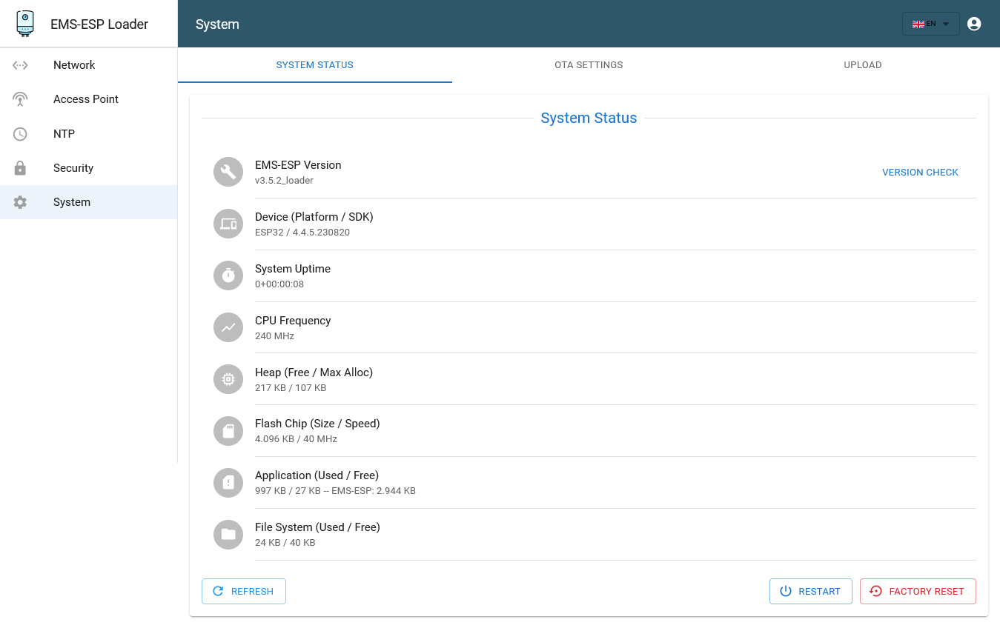

#  LOADER

**EMS-ESP32** is an open-source firmware for the Espressif ESP32 microcontroller that communicates with **EMS** (Energy Management System) based equipment from manufacturers like Bosch, Buderus, Nefit, Junkers, Worcester and Sieger.

This project is only a loader in a smaller factory or OTA-partitions, giving more flash-memory space to full featured EMS-ESP. The loader has to be flashed via USB, use espressif esptool or a special EMS-ESP-Loader-Flasher (coming soon). Supports S32, E32 gateways, ESP32, ESP32-C3, and ESP32-S2 Wifi boards.

# **Libraries used**

- [esp8266-react](https://github.com/rjwats/esp8266-react) by @rjwats for the framework that provides the core of the Web UI
- [ArduinoJson](https://github.com/bblanchon/ArduinoJson) for JSON
- ESPAsyncWebServer and AsyncTCP for the Web server and TCP backends, with custom modifications for performance

# **License**

This program is licensed under GPL-3.0
